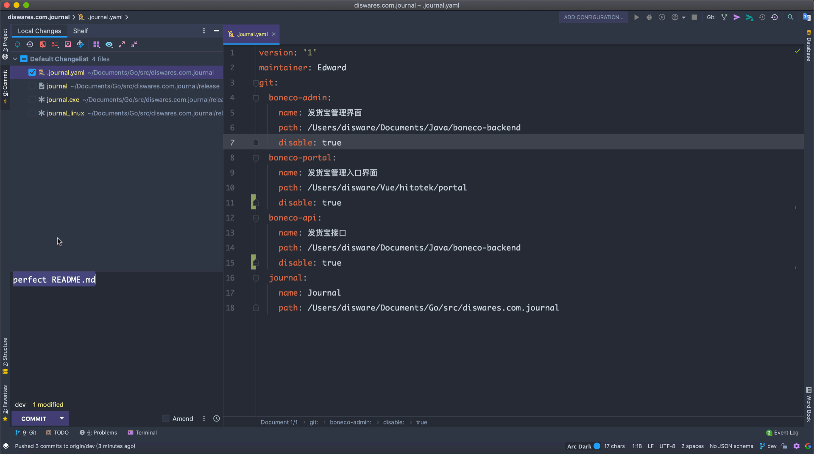

# Journal

> Small but beautiful, simple and performance command line tool (CLI) for daily programming



# How to download ?
See [RELEASE](https://github.com/4everlynn/journal/releases/tag/1.0.0)

# Features

- No need for Git environment, just a project folder managed by Git
- Automatically extract today's report according to the module
- Support disabling some modules
- External configuration file support

# TODO
- [x] Generate daily work reports (multiple projects), free your hands (cmd. journal stylish)
- [ ] File monitoring (via daemon), impl code submission habits statistics (cmd. journal daemon)
- [ ] Work communication space，realize lan command line chat and file transfer (cmd. journal chat -c(-s) -h localhost -P 5432 -p 123456 )

# Getting Start

## .journal.yaml

```yaml
# config version, syntax may be different for different versions in the future
version: '1'
maintainer: 4everlynn
git:
  project:
    name: Project
    # path to your git repo
    path: /home/4everlynn/dev/projcet
    # is disabled
    disable: true
  # another project here
  journal:
    name: Journal
    path: /home/4everlynn/dev/journal
```

## Usage

```bash
./journal stylish
```

### Output


```text
Config maintained by Edward is loaded successfully
20200927 日报
Journal
  1、first commit
  2、Added the option of disable report generation in the warehouse
Project
  1、commit all
  2、version、depot、express and region etc.
  3、impl depot & depot-express api
  4、update query-core's version
  5、version of multipart is change, introduce query-core
  6、commit current code
  7、commit register client api
  8、client api for auth to register
  9、change genius version
  10、region changed
  11、update region api path
  12、add shipper api
  13、add global ex.h & shipper api recreate
  14、commit sys code
```
